Overview
======================
This is a combination of the CRSD-ANT (produced by [Luke Docksteader](http://docksteaderluke.com) and [Kris Scott](http://krssctt.com/)), and the Switch Task (produced by [Matt Booth](https://github.com/BatterySmooth)).

This software was produced for research conducted at the University of Bath.

The origional documentation for the CRSD-ANT can be found [here.]()

Installation
----------
### Download the source files

Click on the "Zip" link in the sidebar above or simply click [here.](https://github.com/BatterySmooth/CRSD-ANT/archive/master.zip)

### Extract the archive

Extract the archive using the zip utility of your choice. Once the archive has been extracted a new folder named "CRSD-ANT & Switch" should now exist.

Flow Diagrams
----------

### Logical Flow Diagram


### Technical Flow Diagram

```mermaid
  flowchart TD
    IX0[index.html] --> IndexOnLoad
    IX0[index.html] -.Immediate redirect.-> IN0[input.html]

    subgraph IndexOnLoad[OnLoad]
    direction TB
      subgraph extractFromURL
      direction TB
        IX1(Get the URL params as a string)
        IX2(Store string to session storage as 'urlParams')

        IX1 --> IX2
      end
    end
    
    IndexOnLoad --> IN0[input.html]

    IN0[input.html] --> InputOnLoad

    subgraph InputOnLoad[OnLoad]
    direction TB
      IN1(Check if user is on Mac)
      IN2(Change fullscreeen instructions if so)
      IN3(Check if current browser is Firefox)
      IN4(Show browser warning if not)
      
      IN1 --> IN2 --> IN3 --> IN4 --> populateFromURL

      subgraph populateFromURL
      direction TB
        IN5(Get 'urlParams' from session storage)
        IN6(Split params into an array)
        IN7(Loop through the array. <br> If the param has been specified, set the value and mark as read only)

        IN5 --> IN6 --> IN7
      end
    end

    InputOnLoad --> |User fills in details| D([Which is the <br> first selected task?])
    D --> |CRSD-ANT| AN0[ANT.html] --> CRSD-ANTOnLoad
    D --> |Switch| SW0[switch.html] --> SwitchOnLoad

    subgraph CRSD-ANTOnLoad[OnLoad]
      AN1(Loop through target types & <br> populate target selection dropdown)
      AN2(Check if user is on Mac)
      AN3(Change fullscreeen instructions if so)
      AN4(Push the 'formInput' view)
      AN5(Check if current browser is Firefox)
      AN6(Show browser warning if not)

      AN1 --> AN2 --> AN3 --> AN4 --> AN5 --> AN6
    end

    
    subgraph SwitchOnLoad[OnLoad]
      SW1(Set background colour to black)
    end

```



CRSD-ANT
======================
Background
----------
The Attention Network Test (ANT) was developed by Jin Fan and Michael Posner.  More information about it can be obtained from [Fan's website](https://www.sacklerinstitute.org/cornell/assays_and_tools/ant/jin.fan/).

In 2009, we published an article introducing the ANT to researchers and clinicians with an interest in driving. At that time, we were using the Java version of the ANT, downloaded free of charge from Fan's website. But it takes approximately 20 minutes to complete, which is too long for our purposes. Therefore, we developed a shorter version of the ANT, called the CRSD-ANT. It was programmed by [Luke Docksteader](http://docksteaderluke.com) and [Kris Scott](http://krssctt.com/), and takes about 10 minutes to complete. We are currently working on an article that reports very strong correlations between measures from the CRSD-ANT and Fan & Posner's Java ANT. Anyone interested in trying the CRSD-ANT can download it (free of charge) below.

License
-------
This work is licensed under the Creative Commons Attribution-NonCommercial-ShareAlike 3.0 Unported License. To view a copy of this licence, visit http://creativecommons.org/licenses/by-nc-sa/3.0/ or send a letter to Creative Commons, 171 Second Street, Suite 300, San Francisco, California 94105, USA.

Any original or modified version of this software must attribute the original work to the following (original) authors, and include a hyperlink (or at very least a URL reference) to their respective Web sites:

- Luke Docksteader - http://docksteaderluke.com
- Kris Scott - http://krssctt.com

Installation
------------
### Download the source files
Click on the "Zip" link in the sidebar above or simply click [here.](https://github.com/docksteaderluke/CRSD-ANT/archive/master.zip)

### Extract the archive
Extract the archive using the zip utility of your choice. Once the archive has been extracted a new folder named "CRSD-ANT" should now exist.

### Running the CRSD-ANT software
Inside of the newly created "CRSD-ANT" folder there should be a file named "index.html". Open this file with the Firefox Web browser and follow the on-screen instructions.

You can use a URL query to pre-populate some of the fields (ID, Session Number, Study ID, Group ID, and Age). This is done in the following format, where '**×**' indicates a value:

> index.html?ID=**×**&sessionNumber=**×**&studyID=**×**&groupID=**×**&age=**×**&firstTrial=**×**

The index.html page will extract the values if they are present and pre-populate the main.html page with those values, marking the text boxes as read-only.
If a value is not present in the URL query, then the input for that field will will not be pre-populated and will be editable.

|	URL Param   |	Element Name	 | Values            |
|-------------|----------------|-------------------|
|ID           |ID              | String (any)      |
|sessionID    |Session #       | String (any)      |
|studyID      |Study ID        | String (any)      |
|groupID      |Group ID  			 | String (any)      |
|age          |Age             | String (any)      |
|firstTrial   |First Trial     | "ANT" or "Switch" |

**Important Note:** The CRSD-ANT program will run in any browser, but timing accuracy is not guaranteed in 
all browsers, and importantly, it is known to be faulty in Internet Explorer.
If you do not have Firefox, you can download it [here.](http://www.mozilla.org/en-US/firefox/new/)  

Adding new stimulus images
--------------------------
1. Find image with an aspect ratio of 1:1, preferably 100x100 pixels. Images must be of type .png to allow for transparency.
2. Create a second version of the image facing the opposite direction.
3. Place both images in the images/targets folder and rename them to "NAMELeft.png" and "NAMERight.png". For example: a horse picture would become "HorseLeft.png" and "HorseRight.png".
4. Add a reference to the image file on line 1 of the config/targetTypes.js file:

```javascript
var stimList = ["Arrow", "Truck", "Hand", "Airplane", "Car", "Horse"];
```

Modifying the number of test blocks
-----------------------------------
1. Open js/navigation.js in the text editor of your choice.
2. Near the top of the file, change the following line, replacing "4" with the desired number of blocks:

```javascript
var numberOfTestBlocks = 4;
```

Data files
----------
Description of Data Files Saved by the CRSD-ANT.

### Table 1: Variables in the raw data file.

|	Variable Name		|	Description											                                    	|	Source					          	|
|-----------------|-----------------------------------------------------------------------|-----------------------------|
|uniqueID				  |Alphanumeric string (with no spaces)						                        |Entered by user			      	|
|StudyNum				  |Alphanumeric string (with no spaces)					                         	|Entered by user			      	|
|age					    |Age of participant (years)								                            	|Entered by user			      	|
|sex				    	|Sex of participant (M, F, N or X)				                            	|Entered by user (checkbox?)	|
|group				  	|Alphanumeric group code								                              	|Entered by user			      	|
|Date				    	|Date of data collection								                               	|Read from system				      |
|block				  	|Block number (0=practice; 1 & 2 for test blocks)	                  		|								              |
|trial				  	|Trial number												                                    |								              |
|CueType			  	|Numeric (1 = No Cue; 2 = Centre Cue; 3 = Double Cue; 4 = Spatial Cue)	|				      	              |
|TargLoc			  	|String (UP or DOWN)									                                	|								              |
|TargDirection		|String: L or R											                                  	|								              |
|Congruency				|String: Congruent or Incongruent					                          		|								              |
|TrialStartTime		|Time at start of trial									                              	|								              |
|targetOnTime			|Time at target onset									                                 	|								              |
|firstFix			  	|Duration of first fixation (panel 1 in Fig 1)			                   	|								              |
|Response			  	|Subject’s response (L, R, or None)						                        	|								              |
|Correct			  	|1=correct, 0 = incorrect[3]								                            |								              |
|RT						    |Response time to nearest millisecond				                        		|								              |
|LowRT				  	|Set to 1 if RT < 100 ms, 0 otherwise					                        	|								              |

[3] Set variable CORRECT to 1 if the subject’s response matches the correct response, and if the RT is in the range 
100 to 1500 ms. Otherwise, CORRECT = 0.


Switch Task
======================
Background
----------
The Switch task was created to work with the CRSD-ANT as part of a research project at the University of Bath. The Switch Task is decribed in X paper. The structure has been modified from the CRSD-ANT as described above in order to give the same user experience throughout the two trials and to provide the framework for the test.

License
-------
This work is licensed under the Creative Commons Attribution-NonCommercial-ShareAlike 3.0 Unported License. To view a copy of this licence, visit http://creativecommons.org/licenses/by-nc-sa/3.0/ or send a letter to Creative Commons, 171 Second Street, Suite 300, San Francisco, California 94105, USA.

Any original or modified version of this software must attribute the original work to the following (original) author & ANT framework authors, and include a hyperlink (or at very least a URL reference) to their respective Web site or GitHub Profile:

- Matt Booth (Switch Task) - https://github.com/BatterySmooth
- Luke Docksteader (ANT Framework) - http://docksteaderluke.com
- Kris Scott (ANT Framework) - http://krssctt.com

Trial Stages
----------
Within each response, the trial is broken up into 4 stages and an initiation stage:

| Stage       | Actions                                                                                                                        |
|-------------|--------------------------------------------------------------------------------------------------------------------------------|
| Trial Start | Set Trial Array, Generate Blanking interval for 1st trial, Call Stage 1                                                        |
| Stage 1     | Reset Trial Response & Response time, Show the fixation cross                                                                  |
| Stage 2     | Set timeout for Stage 2, Enable keypress event, Show arrow                                                                     |
| Stage 3     | Set timeout for Next Stage, Blank screen, Increment index counter                                                              |
| Next Stage  | Disable keypress event, Collect stage results, Check if end of trial; If not, call Stage 1. If so, generate & store export URI |

Modifying the Number of Trials
-----------------------------------
1. Open js/navigation.js in the text editor of your choice.
2. Near the top of the file, change the following line, replacing "4" with the desired number of blocks:

```javascript
var numberOfTestBlocks = 4;
```

Variables
----------
| Variable Name           | Type    | Scope              | Description                                                                                                              |
|-------------------------|---------|--------------------|--------------------------------------------------------------------------------------------------------------------------|
| **Config**                                                                                                                                                                        |
| SwitchTrialSet          | array   | Global             | An array of the switch task trials to be iterated over to run the trial                                                  |
| SwitchTrialSetCount     | int     | Global             | **Constant** The number of each trial set to add to **SwitchTrialSet** before it is shuffled                             |
| **SwitchNavigation.js**                                                                                                                                                           |
| ResultsData             | array   | Global             | Results data array                                                                                                       |
| SoftwareVersion         | string  | Global             | Software Version number                                                                                                  |
| **SwitchBrowserChack.js**                                                                                                                                                         |
| isFirefox               | bool    | BrowserCheck()     | Is the current browser Firefox                                                                                           |
| **SwitchBreakTimer.js**                                                                                                                                                           |
| RunBreakTimer           | bool    | Local              | Control variable to prescribe whether the break timer at the start of the Switch trial should run - initialised as FLASE |
| TimerSecs               | int     | Local              | The seconds elapsed since the start of the break timer - initialises as 0                                                |
| BreakTimerSecs          | int     | BreakTimerTicker() | **Functional** - the count of seconds elapsed in the break timer (as mod 60)                                             |
| BreakTimerMins          | int     | BreakTimerTicker() | **Functional** - the count of minutes elapsed in the break timer                                                         |
| **SwitchArrayShuffle.js**                                                                                                                                                         |
| CurrentIndex            | int     | ShuffleArray()     | **Functional** - The index of the current array item                                                                     |
| RandomIndex             | int     | ShuffleArray()     | **Functional** - A generated random index for the array while shuffling                                                  |

